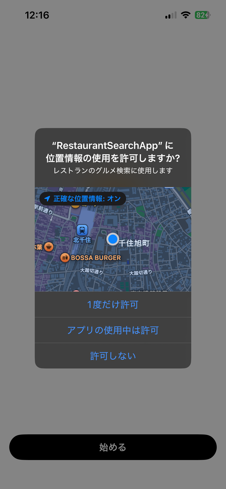
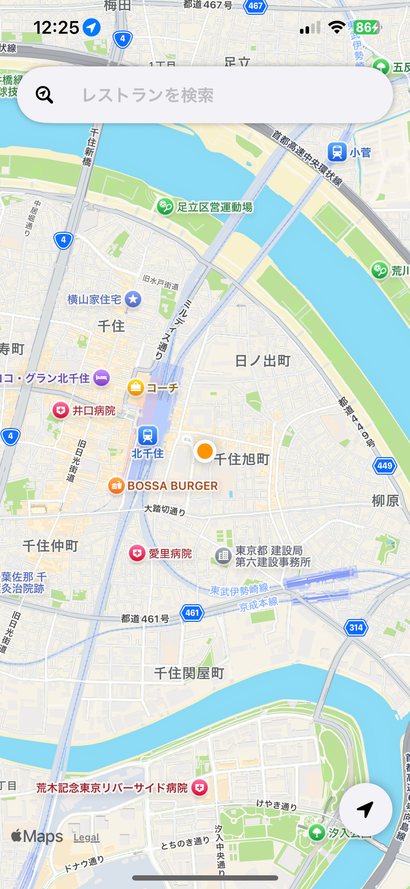
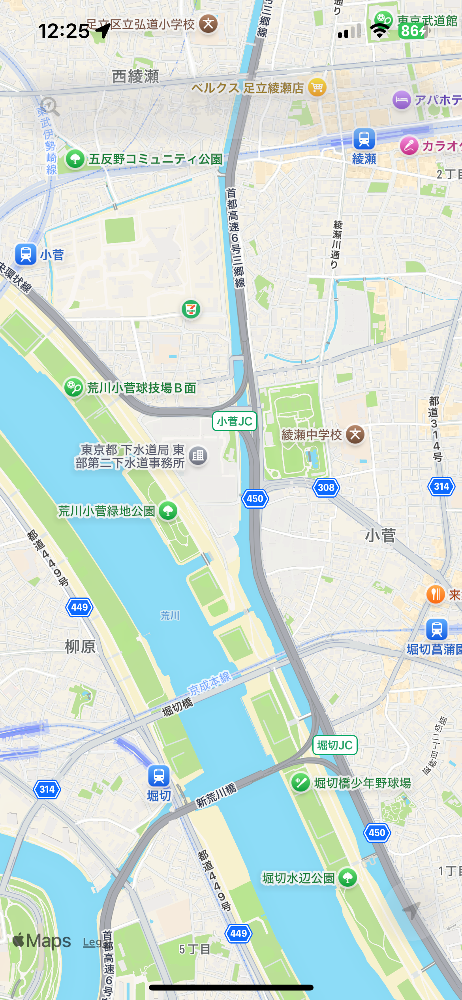
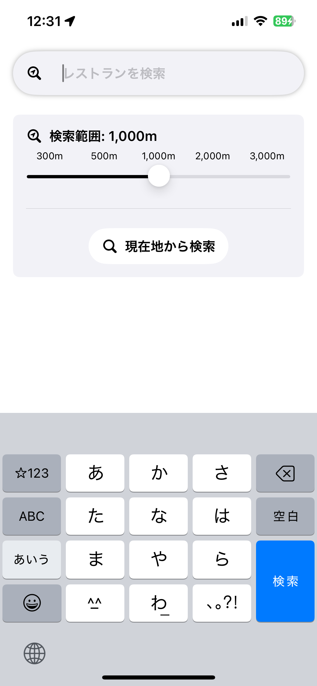
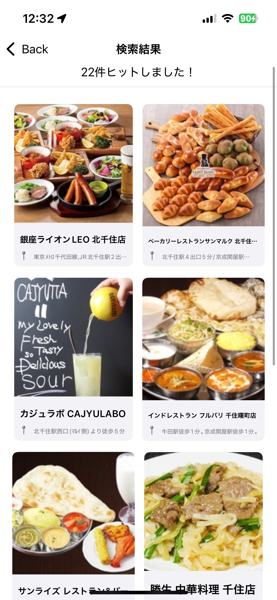
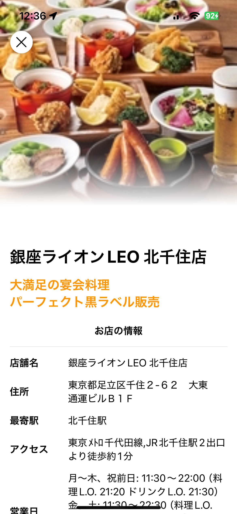
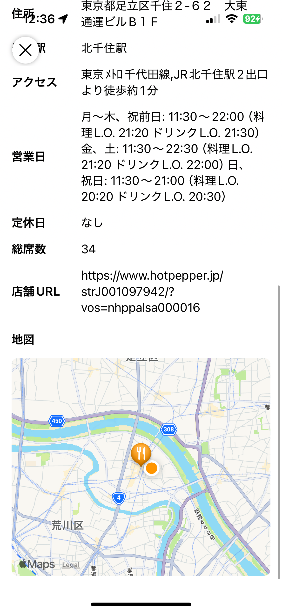

# 簡易仕様書

### 作者
石井 大翔
### アプリ名
RestaurantSearchApp

### 該当プロジェクトのリポジトリ
https://github.com/sattsat-tdu/RestaurantSearchApp

## 開発環境
### 開発環境
Xcode 16.0

### 開発言語
Swift 5

## 動作対象端末・OS
### 動作対象OS
iOS 17.0以上

## 開発期間
7日間

## アプリケーション機能

### 機能一覧
- レストラン検索：ホットペッパーグルメサーチAPIを使用して、現在地周辺の飲食店を検索する。
- レストラン情報取得：ホットペッパーグルメサーチAPIを使用して、飲食店の詳細情報を取得する。

### 画面一覧
- 認証画面 ：位置情報への許可を促す。
初回起動時にすぐに認証を促すのではなく、認証画面を表示してから認証を促すようにした。

|起動画面|認証画面|認証拒否画面|
|---|---|---|
||||

<!--  -->

- ホーム画面 ：現在地をマップに表示する。
マップの上に表示する項目として、
    - 検索バー: 検索するために使用
    - 現在地ボタン: ユーザーの現在地から離れている場合に、押下時に再フォーカス

|通常時|スクロール時|
|---|---|
|||

- 検索画面 ：検索範囲 or キーワードを指定してレストランを検索する。
    - 検索バー: キーワードをリクエストに、APIへ通信
    - スライダー: 検索範囲を指定
    - 現在地から検索ボタン: 現在地と検索範囲をリクエストに、APIへ通信

|検索画面|
|---|
||

- 一覧画面 ：検索結果のレストランを2行で一覧表示する。
検索結果がヒットしない場合にも対応

|検索結果あり|検索結果なし|
|---|---|
|||

- レストラン詳細画面 ：画像、住所、マップなどのレストランの情報を表示する。
画像や、キャッチフレーズを大きく表示し、ユーザーに的確にお店情報を伝える。
現在地とお店の位置を表示するミニマップを表示し、どれだけ近いのかを視覚的に伝える。

ここで、ナビゲーションバーを非表示にしつつ、スワイプで前の画面に戻れるようにするため、一部UIKitを使用。

```swift
extension UINavigationController: @retroactive UIGestureRecognizerDelegate {
    override open func viewDidLoad() {
        super.viewDidLoad()
        interactivePopGestureRecognizer?.delegate = self
    }

    public func gestureRecognizerShouldBegin(_ gestureRecognizer: UIGestureRecognizer) -> Bool {
        return viewControllers.count > 1
    }
}

```

|レストラン詳細画面|
|---|
||

### 使用しているAPI,SDK,ライブラリなど
- ホットペッパーグルメサーチAPI
- MapKit
- kingfisher

#### コンセプト
行きたいレストランを見つけます。

#### こだわったポイント
- 位置情報の許可を断ってしまった場合の処理も考え、ユーザーに困惑を与えないようにした
- APIへの通信中はProgressViewを表示し、通信中であることを明確にした

#### デザイン面でこだわったポイント
- マップのスクロール中は、検索バー、ボタンの透過度をあげ、マップの視認性を向上させた
- お店詳細画面において、お店の画像を全体画面の半分ほど大きく表示することで、ユーザーに視覚的に情報を伝えることを意識した

### アドバイスして欲しいポイント
- ディレクトリ構成
- コードの書き方

### 自己評価
与えられた最低条件を達成することができて一安心でした。ホットペッパーグルメAPIと、MapKitをうまく組み合わせて実装できたのが自分で評価できるポイントでした。ただ、多くのアプリで実装されている検索バーを押した時のフェードアニメーションを実装することができなかったのが残念でした。
